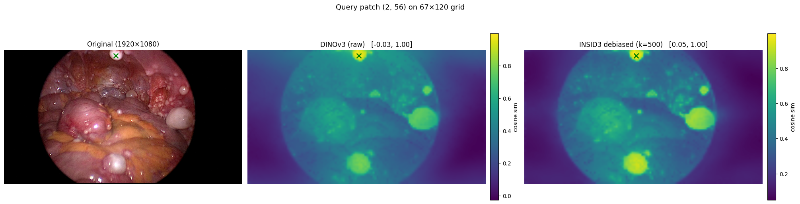

# Tumor-Segmentation

Training-free, point-prompted tumor segmentation using frozen **DINOv3** features with **INSID3 positional debiasing**.

Click a few points on a tumor (and optionally on background), and the model returns a similarity map and a binary mask. No fine-tuning or labeled data required.

## Why debiasing?

DINOv3 patch embeddings encode *where* a patch is as well as *what* it contains. As a result, cosine similarity between patches is dominated by spatial proximity: a tumor patch on the left side of an image looks dissimilar to a tumor patch on the right, simply because they are far apart.

Following [INSID3](https://github.com/visinf/insid3), we remove this positional signal:

1. Pass pure Gaussian noise through DINOv3. Noise has no semantic content, so the resulting embeddings encode only position.
2. Take the top-K singular vectors (SVD) of those embeddings as the **positional subspace**.
3. For a real image, project its DINOv3 embeddings onto the orthogonal complement of that subspace.

The debiased features now match patches by content, not location.



*Left: input image. Middle: similarity map from raw DINOv3 features. Right: similarity map from debiased DINOv3 features.*

## How segmentation works

1. Extract debiased DINOv3 patch features.
2. Take the feature of the patch under each prompt point.
3. Similarity map = mean cosine similarity to positive patches − mean cosine similarity to negative patches.
4. Upsample to the original resolution and threshold (default `> 0`) to get the mask.

## Setup

```bash
git clone --recurse-submodules https://github.com/Zain-Mrza/TumorSegmentation.git
```

```bash
conda env create -f environment.yml
```

```bash
conda activate tumor_segmentation
```

DINOv3 is included as a submodule in `external/dinov3`. Download the pretrained weights (e.g. `dinov3_vitl16_pretrain_lvd1689m.pth`) from the [DINOv3 repo](https://github.com/facebookresearch/dinov3) and note the local path.

## Usage

### Command line

```bash
python insid3_point_prompt.py --image assets/frame.jpg --repo_dir external/dinov3 --weights /path/to/dinov3_vitl16_pretrain_lvd1689m.pth --pos 512,300 540,320 --neg 100,100 --out_mask mask.png --out_vis vis.png
```

Points are `x,y` in original image pixels. Useful flags:

| Flag | Description |
| --- | --- |
| `--pos` / `--neg` | Positive / negative prompt points |
| `--thresh` | Similarity threshold for the mask (default `0`) |
| `--image_size` / `--patch_grid` | Encoder resolution (default `768`) |
| `--svd_components` | Size of the positional subspace (default `500`) |
| `--no_debias` | Use raw DINOv3 features for comparison |
| `--out_sim` | Save the raw similarity map as `.npy` |

### Python

```python
from insid3_debias import INSID3Debias, load_dinov3_local
from insid3_point_prompt import segment_from_points

encoder = load_dinov3_local("external/dinov3", "dinov3_vitl16", weights="/path/to/weights.pth")
model = INSID3Debias(encoder, image_size=768)

mask, sim = segment_from_points(model, "assets/frame.jpg", pos_points=[(512, 300)], neg_points=[(100, 100)])
```

See [`insid3_point_prompt_demo_1.ipynb`](insid3_point_prompt_demo_1.ipynb) for an interactive walkthrough.

## Repository structure

```
insid3_debias.py                  # DINOv3 loading + positional debiasing
insid3_point_prompt.py            # Point-prompted similarity maps and masks (CLI + API)
insid3_point_prompt_demo_1.ipynb  # Demo notebook
utils.py                          # Plotting helpers
external/dinov3/                  # DINOv3 submodule
assets/                           # Example images
```

## Acknowledgements

- [DINOv3](https://github.com/facebookresearch/dinov3) (Meta AI)
- [INSID3](https://github.com/visinf/insid3) for the positional debiasing method
